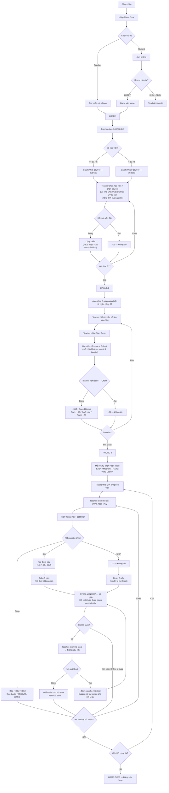

```mermaid
flowchart TD
    A[Đăng nhập] --> B[Nhập Class Code]
    B --> C{Chọn vai trò}
    C -->|Teacher| D[Tạo hoặc mở phòng]
    C -->|Student| E[Join phòng]
    E --> F{Round hiện tại?}
    F -->|LOBBY| G[Được vào game]
    F -->|Khác LOBBY| H[Từ chối join mới]

    D --> I[LOBBY]
    G --> I

    %% ─────────────── ROUND 1 ───────────────
    I --> J[Teacher chuyển ROUND 1]
    J --> J0{"Số học viên?"}
    J0 -->|">= 10 HS"| J1["Cấu hình: 5 câu/HV — 30đ/câu"]
    J0 -->|"< 10 HS"| J2["Cấu hình: 10 câu/HV — 15đ/câu"]
    J1 --> K
    J2 --> K

    K["Teacher chọn học viên + chọn câu hỏi\n(Độ khó EASY/MEDIUM do GV tự căn,\nkhông ảnh hưởng điểm)"]
    K --> L{Kết quả vấn đáp}
    L -->|Đúng| M["Cộng điểm\n(+30đ hoặc +15đ\ntheo cấu hình)"]
    L -->|Sai| N[+0đ — không trừ]
    M --> O{Kết thúc R1?}
    N --> O
    O -->|Chưa| K
    O -->|Rồi| P

    %% ─────────────── ROUND 2 ───────────────
    P[ROUND 2]
    P --> P1["Auto chọn 5 câu ngẫu nhiên\ntừ ngân hàng đề"]
    P1 --> P2[Teacher hiển thị câu hỏi lên màn hình]
    P2 --> P2b[Teacher nhấn Start Timer]
    P2b --> P3["Học viên viết code + Submit\n(mỗi HS chỉ được submit 1 lần/câu)"]
    P3 --> P4{Teacher xem code → Chấm}
    P4 -->|Đúng| P5["+30đ + Speed Bonus\nTop1: +6đ / Top2: +4đ / Top3: +2đ"]
    P4 -->|Sai| P6[+0đ — không trừ]
    P5 --> P7{Còn câu?}
    P6 --> P7
    P7 -->|Còn| P2
    P7 -->|Hết 5 câu| Q

    %% ─────────────── ROUND 3 ───────────────
    Q[ROUND 3]
    Q --> Q0["Mỗi HS tự chọn Pack 3 câu\n(EASY / MEDIUM / HARD)\nvà tự Lock In"]
    Q0 --> Q1[Teacher mở lượt từng học viên]
    Q1 --> Q2[Teacher chọn chế độ: ORAL hoặc MCQ]
    Q2 --> Q3[Hiển thị câu hỏi + bật timer]
    Q3 --> Q4{Kết quả câu chính}

    Q4 -->|Đúng| Q5["+40đ / +60đ / +80đ\ntheo EASY / MEDIUM / HARD"]
    Q4 -->|Sai| Q6A["Trừ điểm câu\n(-40 / -60 / -80đ)"]
    Q4 -->|SKIP| Q7A["0đ — không trừ"]

    Q6A --> Q6B["Delay 5 giây\n(HS thấy kết quả sai)"]
    Q7A --> Q7B["Delay 5 giây\n(chuẩn bị mở Steal)"]

    Q6B --> Q8
    Q7B --> Q8

    Q8["STEAL WINDOW — 15 giây\nHS khác bấm Buzz giành quyền trả lời"]
    Q8 --> Q8b{Có HS buzz?}
    Q8b -->|Có| Q9["Teacher chọn HS steal\n→ Trả lời câu hỏi"]
    Q8b -->|Hết 15s / Không ai buzz| Q12

    Q9 --> Q10{Kết quả Steal}
    Q10 -->|Đúng| Q10a["+điểm câu cho HS steal\n→ Kết thúc Steal"]
    Q10 -->|Sai| Q11["-điểm câu cho HS steal\nBuzzer mở lại 5s sau cho HS khác"]
    Q11 --> Q8

    Q5 --> Q12
    Q10a --> Q12

    Q12{HS hiện tại đủ 3 câu?}
    Q12 -->|Chưa| Q2
    Q12 -->|Rồi| Q13{Còn HS chưa thi?}
    Q13 -->|Còn| Q1
    Q13 -->|Hết| R[GAME OVER — Bảng xếp hạng]
```