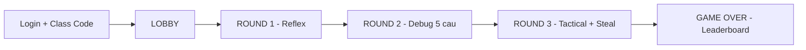

# Run and deploy your AI Studio app

This contains everything you need to run your app locally.

View your app in AI Studio: https://ai.studio/apps/drive/1uH2fHvQIHHBlV1JQgaWzJTTok3xCOj2c

## Run Locally

**Prerequisites:**  Node.js

1. Install dependencies:
   `npm install`
2. Set the `GEMINI_API_KEY` in [.env.local](.env.local) to your Gemini API key
3. Run the app:
   `npm run dev`

## Recent Updates (Scoring & Logic)
- **Round 1**: Dynamic Points (30/15 depending on players).
- **Round 2**: Strict Deadline, Speed Bonuses (+6/+4/+2).
- **Round 3**: Timeout No Penalty, Steal Penalty, Fixed Point Values (40/60/80).

## Luong Hoat Dong Nhanh (User-Friendly)

### 1) Vao phong va chon vai tro
- Nguoi choi dang nhap (Google hoac Guest), nhap `Class Code`.
- `Teacher` tao/quan ly phong.
- `Student` vao phong va dat ten.
- `Screen` chi hien thi man hinh tong hop.
- Hoc vien chi duoc vao khi game dang o `LOBBY` (khi da vao round thi phong khoa join moi).

### 2) LOBBY
- Teacher chot danh sach hoc vien.
- Teacher bam chuyen round bat dau tro choi.

### 3) ROUND 1 - Reflex Quiz
- Teacher chon hoc vien dang co luot.
- Teacher chon cau hoi va bat timer ngan.
- Hoc vien tra loi nhanh (van dap).
- Teacher cham:
- Dung: +30 diem (neu lop >= 10 hoc vien) hoac +15 diem (neu < 10 hoc vien).
- Sai: 0 diem.
- Lap lai den khi ket thuc vong.

### 4) ROUND 2 - Obstacle (Debug Code)
- He thong tao bo 5 cau hoi cho vong 2 (auto-init khi vao round).
- Moi cau:
- Teacher hien de + bat timer.
- Hoc vien gui code (1 lan/cau, nop muon bi tu choi).
- Teacher mo bai tung hoc vien de cham Dung/Sai.
- Tinh diem:
- Dung: +30 diem.
- Thuong toc do cho bai dung: top 1 +6, top 2 +4, top 3 +2.
- Sai: 0 diem.
- Teacher chuyen cau tiep theo cho den het 5 cau.

### 5) ROUND 3 - Tactical Finish
- Moi hoc vien chon va lock goi 3 cau (EASY/MEDIUM/HARD).
- Teacher mo luot tung hoc vien.
- Teacher mo cau hoi theo do kho, chon che do:
- `ORAL`: hoc vien tra loi van dap.
- `QUIZ`: hoc vien bam dap an tren dien thoai.
- Cham diem cau chinh:
- EASY: dung +40, sai -40.
- MEDIUM: dung +60, sai -60.
- HARD: dung +80, sai -80.
- SKIP: 0 diem.
- Neu sai thi mo co che `STEAL`:
- Delay ngan -> mo cua so cuop cau 15s.
- Nguoi choi khac buzz de gianh quyen.
- Teacher chon nguoi cuop va cham:
- Dung: +diem cau.
- Sai: -diem cau, mo lai cho nguoi khac cuop tiep.
- Moi hoc vien xong khi da hoan thanh 3 muc trong pack.

### 6) GAME OVER
- Teacher bam ket thuc.
- He thong hien bang xep hang chung cuoc.
- Diem khong am (san diem = 0).

### 7) Dieu khien bo sung cho Teacher
- Co the cong/tru diem thu cong neu can.
- He thong luu checkpoint sau moi vong.
- Co the reset ve Round 1 / Round 2 / Round 3 tu checkpoint.

### So do luong tong quat

## Deployment Note
When deploying to Vercel/Linux, ensure the ambiguous `types/` directory is **NOT** present to avoid circular dependency errors with `types.ts`. The project root `types.ts` is the single source of truth.
